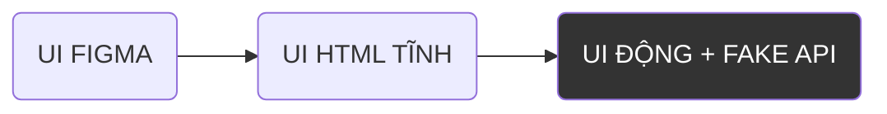

# FRONTEND OF MG APP 
Các nền tảng mà mình sẽ sử dụng: 
1. HTML thuần 
2. Tailwind CSS, DaisyUI
3. JS thuần 
4. Phong cách State driven UI 

**Mục đích:**
1. Phải mượt mà và rõ ràng (Usability).
2. Để người dùng tập trung vào Lời dạy và Bài học vì nó là không gian suy ngẫm. 

**Lộ trình:**



## UI FIGMA 
Link tới trang figma: [MG APP UI FIGMA](https://www.figma.com/design/0VcYiHtWtbULjDc7OJQ2Nh/My-website?node-id=188-3&t=3Li8y3uja7vDxVGN-4)

> NOTE: rất quan trọng vì quyết định phần nhìn và các đảm bảo bước đầu cho việc dễ sử dụng theo đúng các mục đích của hệ thống. 

### Ý tưởng thiết kế cho các trang: 
1. Mobile content thuộc dạng thẳng đứng từ trên xuống. 

---
Cho user: 
1. Thanh navbar luôn fixed ở trên cùng. Gồm có logo và icon menu để di chuyển giữa các trang cũng như truy cập các hành động liên quan đến người dùng (hiện tại chỉ có một là đăng xuất). 
    1. Side navigation thì phải rõ ràng và rõ hierachy để người dùng trước hết là nhìn vào các lựa chọn, sau đó mới tới title, và navigation nhỏ. Và phải rõ là clickable. 
3. Trong trang home: 
    1. Lời dạy và bài học không hiển thị full mà hiển thị preview và hiển thị tốt để người dùng scan. 
    2. Mục purpose thì hiển thị ở dạng list và nội dung là title và hope, 2 cái cũng được nhưng chữ phải rõ để người dùng scan. 
    3. Mục note thì hiển thị title và content preview. Nhưng cũng phải hiển thị tốt để người dùng scan. 

4. Khi ấn vào bất cứ thực thể nào thì sẽ vào trang thực thể đó. 
    1. Tổng quan: Các trang đều có một icon bên trái là quay lại và sẽ quay lại trang trước đó. Còn bên phải là icon "born" để mở ra menu hiển thị purpose và note sinh ra từ bối cảnh là thực thể này. Trong menu đó thì hiển thị cơ bản như title của note và của hope. Muốn coi kĩ thì phải click vào nữa. 
    2. Tổng quan: Các trang đều có một icon để mở ra các hành động để chọn. Trong đó có 2 hành động là tạo note tự do và tạo purpose tự do. 
    3. Khi vào trong trang Lời dạy thì sẽ có display code, tiêu đề, nội dung thôi. Còn cách hiển thị sao cho usability thì mình sẽ làm thử và cân nhắc thêm. 
    4. Khi vào trang bài học. Thì có các phần như vậy, tiêu đề, nội dung chính, nhận biết cá nhân. Mình đang suy nghĩ là có thể bị đè chức năng ở note tự do và ghi chép nhận biết cá nhân. Hai là sắp xếp các phần nội dung cần hiển thị trên như thế nào cho usability nữa thì sẽ làm thử và cân nhắc thêm. 
    5. Khi vào trang mục đích. Thì hiển thị các phần nội dung như tiêu đề, Hy vọng, hành động. Hiển thị như nào để usability. Cần phải tập trung vào mục đích và hành động, hy vọng không cao bằng 2 thành phần kia. Và phải làm sao cho dễ dàng với các thao tác trong này như đổi status của purpose và action cũng như delete action, add action, thay đổi context action. 
    6. Khi vào trang note. Thì hiển thị các phần nội dung như display code, title, content. Tập trung vào content và status. 
    7. Suy nghĩ để cách sử dụng đơn giản cho các phần mà ghi chép được thì khi click 2 lần liên tiếp (thời gian xác định) để có thể từ chế độ view vào edit của các phần mà có thể edit được như nhận biết cá nhân của bài học, tiêu đề và hy vọng của mục đích, context của hành động, content của note. 


5. Khi vào trang lời dạy thì mình sẽ list ra theo thứ tự từ gần nhất tới xa nhất do Lời Dạy thì có thông tin ngày nên có thể làm như vậy. Và sẽ hơi gộp lại các lời dạy theo tuần. Hiển thị dạng list cũng như vậy, display code, tiêu đề, preview content. 
6. Khi vào trang bài học thì sẽ liệt kê ra thôi để người dùng tìm, đơn giản vậy thôi. 
7. Màu sắc cho trang web sẽ như thế nào? Typo cho trang web sẽ như thế nào? Mình sẽ học hỏi thêm. 

----
Cho admin 
1. navbar chung: logo bên trái, menu bên phải. Trong menu có các phần như Trang lời dạy, trang bài học. 
2. Trang chủ thì có hiển thị danh list các pending user và rejected user. 
3. Trang lời dạy thì có phần đăng lời dạy mới trên cùng, và dưới là list các lời dạy đã đăng hiển thị dạng list (có preview). Có thể click vào để edit nội dung. 
    1. Trong trang thực thể lời dạy của admin thì hiển thị display code, tiêu đề, nội dung. Hiển thị sao usability với user là admin. 
4. Trang bài học thì hiển thị dạng list các bài học, không preview. Và có thể click vào để edit nội dung chính. 
    1. Trong trang thực thể bài học của admin thì hiển thị tiêu đề, nội dung chính. Hiển thị sao cho usability với user là admin. 


### Yêu cầu của các trang kèm với cách sử dụng các chức năng trong trang: 
> Phần UX: thì quan tâm đầu tiên về phần nhìn, còn về phần hành vi cụ thể hơn thì sẽ do bên Frontend lo. Ý là nói về Usability. 

Cho user: 
1. Trang chủ: Mình định là để khi user vào đây thì có thể xem đầy đủ nhưng nghĩ kĩ thì trang này nên ở dạng preview tất cả những điều mình nên để ý tới thôi. Còn cụ thể thì phải click để vào. Nhưng cách trang mình thiết kế chưa clickable. Nghĩa là mục đích là preview để xem tổng quan nhưng hướng tới click để vào trang thực thể để suy nghĩ tổng quan hơn. 
    1. Các thành phần phải nhìn biết là có thể click vào để xem đầy đủ. Lời dạy khác, bài học khác, mục đích khác, note khác. 
        - [x] clickable content. 
    2. Và hiển thị sao cho xem được preview tốt nội dung. 
        - [x] good preview 
2. Trong trang thực thể thì phải mang tính suy nghiệm và suy nghĩ sâu. 
    1. Nội dung phải được hiển thị sao cho dễ đọc sâu. 
        - [x] Màu sắc phù hợp với yêu cầu trên. 
        - [ ] Font chữ phù hợp với yêu cầu trên. 
        - [ ] Và các cách bài trí nội dung khác phải phù hợp với yêu cầu trên. 
    2. Các thành phần mà có thể chỉnh sửa thì phải hiển rõ là thành phần có thể chỉnh sửa. 
        - [ ] Hiện rõ thành phần có thể chỉnh sửa. 


## UI HTML TĨNH
> note: không thay đổi theo trạng thái, tương tác.  

### Ý tưởng: 
1. Lướt xuống thì đổi màu nền một cách nhẹ nhàng khi vào mục của một loại thực thể khác. Không rõ là phần này thì thuộc UI động hay UI tĩnh. Ứng dụng trong trang home và có thể các trang khác. 
2. List trong action thì chia ra làm 2 phần: phần trọn vẹn thì đối với cái phần trên thì sắp xếp theo trọn vẹn mới nhất lên trên cùng. Còn phần chưa trọn vẹn thì cái cũ nhất lên trên cùng. 


### Các trạng thái của hệ thống: 
```javascipt
const state = {
    user: {
        id: "id of user", 
        fullname: "fullname of user", 
        email: "email of user", 
        username: "username of user", 
        role: "role of user", 
        updatedAt: "updating time of user"
    } || null, 

    route: {
        name: "LOGIN" || "SIGNUP" || "HOME" || "TEACHING_WORDS" || "LIFE_LESSONS" || "ENTITY", 
        userRole: "USER" || "ADMIN" || null, 
        currentEntity: {
            type: "PURPOSE" || "TEACHING_WORD" || "LIFE_LESSON" || "NOTE" || "USER", 
            id: "id of current entity"
        } || null, 
    },

    cache: {
        teachingWords: {
            "id1": {
                id, 
                title, 
                content, 
                updatedAt
            }
        }, 
        lifeLessons: {}, 
        purposes: {
            "id1": {
                id, 
                title, 
                hope, 
                status, 
                updatedAt, 
                numIncompleteActions, 
                actions: [
                        id: 
                        context,
                        status, 
                        updatedAt
                    ]
                }
            }
        }, 
        notes: {}, 
        relations: {
            origin: {}, 
            born: {
                "NOTE-1": {
                        purposes: [
                            {
                                id
                            }
                        ], 
                        notes: [
                            {
                                id
                            },
                        ]
                }
            }
        },
        users: {}
    }

    ui: {
        loading: true || false, 
        disabled: true || false, 
        fabState: 0 || 1 || 2
        overlayEntity: "NOTE_FREE_WRITE" || "PURPOSE_FREE_WRITE" || "ACTION_ADDITION" || null || initial: null, 
        saveStatus: "SAVED" || "SAVING" || "EDITTING", 
        noteTypeMenuOpen: true || false || initial: false, 


    }, 
    error: "network error" || null

}


```


### Vấn đề kĩ thuật: 
Cách đặt tên để lưu trữ trong cache (phục vụ tra cứu theo key): "`TYPE`-`ID`", ví dụ: "NOTE-2", "TEACHING_WORD-134", ... v.v


## UI ĐỘNG + FAKE API
> note: thay đổi theo trạng thái tương tác. 

### Ý tưởng: 
1. Icon để chọn hành động trong trang thực thể thì khi bình thường nó sẽ gần như trong suốt, còn khi người dùng click vào nó lần 1 thì nó sẽ hiển thị rõ ra. Và khi click lần nữa trong vòng dưới bao nhiêu giây từ lần click 1 thì nó sẽ vào chọn hành động. Còn không thì tự động gần như trong suốt lại. 
2. Khi lướt thì sẽ lướt kiểu khó vô tình lướt nhẹ mà sang phần của thực thể khác mà phải lướt nhiều hơn thì mới sang phần của thực thể khác lúc ở trong trang chủ. 
3. Trong các phần mà vừa xem vừa có thể edit thì các phần đó như sau: khi chưa ấn vào thì là view mode, còn khi ấn vào là edit mode. Cần báo rõ trạng thái lưu như thế nào để người dùng biết. 
4. Về animation phải rõ ràng và không được quá nhanh để người dùng cân nhắc hơn trong việc đổi trạng thái của các thực thể như purpose, action. 
5. Khi bắt đầu lướt thì đổi shadow của navbar từ sm thành md. 

## KẾT NỐI API 