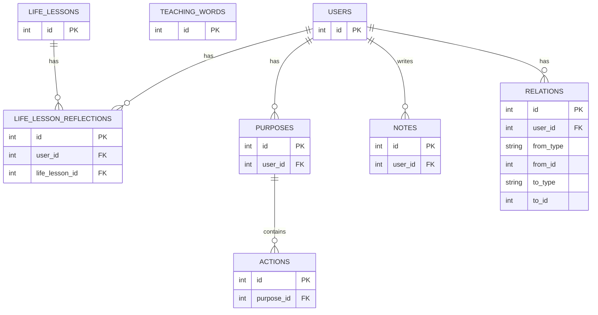

# Dự án MY SCRUM
Dự án làm việc mà dựa theo mục đích và ino với HA để xác định là đã xong hay chưa. Và theo tuần thì sẽ có hiện ra random LC của tuần đó. 

Dự án làm việc theo mục đích, xong hay chưa thì sẽ do 1 người độc lập quyết định. Sẽ có các câu châm ngôn (phương hướng làm việc trong tuần) hiện ra mỗi khi vào. Và lúc vào thì sẽ có mục để ghi chép những câu chuyện xảy ra, hoặc các điều xảy tới nhưng chưa biết ý nghĩa là gì?. Và hiển thị phần trăm việc đang làm. 


Kiến trúc làm: modular monolith


## Phân tích dự án: 
### Triết lí của hệ thống: 
Nó là không gian suy nghiệm và đọc LC nên chỉ có thực thể sinh ra mới trong bối cảnh của thực thể nào đó (hoặc không và sau đó có thể vào trang của thực thể đó và gắn liên kết tới bối cảnh). Cụ thể là A --> B, A sinh ra từ bối cảnh của B. 


### Quy mô hiện tại (v1) của hệ thống: 
Là một hệ thống đọc và học Lời dạy và suy ngẫm của cá nhân. 


### Điều trọng tâm 
Các điều trọng tâm của dự án: 
1. Dự án khiến cho con người sống tập trung vào mục đích mà sống hướng theo những Lời của Thầy. Nó không phải là app productivity, hay app hướng đến công việc. Giúp người dùng không quên những điều đã được dạy, phương hướng hành động và sống, tập trung vào lời dạy của Thầy. Nghĩa là lúc vào thì sẽ thấy các Lời Dạy trong tuần đầu tiên. 
2. Trung tâm phương hướng và mục đích được tách ra từ các văn bản mà nằm trong các mục mà được thêm vào hằng tuần. Đối với người dùng thì sẽ có 30 văn bản riêng về 30 bài học trong cuộc sống mà đối với mỗi người thì sẽ có phần nhận định riêng và nhận biết tùy theo mỗi người. Bạn hiểu không? Các văn bản chung thì sẽ hiển thị chung, còn 30 bài học cuộc sống thì tùy vào mỗi người nhận biết. Và hệ thống sẽ dựa vào đó mà sẽ cho các gợi ý để đọc khi mới vào hệ thống. 
3. Và có phần log, có 2 loại log: điều đã trải qua, điều gặp phải nhưng chưa hiểu và lí giải được (có phần log về giải thích cho điều đó). 
4. Ở mỗi mục đích thì có các mục tiêu nhỏ (mình không chắc có phải là task hay không?) Nếu vậy thì trung tâm sẽ là "purpose" và trong "purpose" thì có thể có hoặc không có "task" kèm theo và trong "purpose" lớn có "purpose" nhỏ. 
5. Tạm dừng không suy nghĩ gì về thế nào là hoàn thành, vì đối với mục đích là dài hạn và đôi khi mục đích là đạt được trong cuộc sống, và đang sống cuộc sống đó. Vì thế nên mới có 30 bài học cuộc sống. Nên đối với mục đích thì đừng suy nghĩ sớm về hoàn thành, nó không phù hợp vì nó không phải là task, done với task, chứ không phải với mục đích, mục đích là gì đó cao hơn mà mình chưa biết. 


> Câu hỏi❓: Trung tâm suy nghĩ là não thì hệ thống hỗ trợ ở mức nào thì hợp lí?
> Câu trả lời: Chỉ hỗ trợ các công cụ để ghi chép tự do, và hỗ trợ việc đọc và học Lời dạy còn lại thì những gì sinh ra mới và suy nghĩ thì tự não phải sinh ra, hệ thống không tự động sản sinh gì cả. 


### Các loại người dùng của hệ thống: 
1. user: bao gồm tất cả những chức năng trong phần trọng tâm. 
2. admin: đăng lên Lời dạy theo tuần và được quyền sửa lại phần khung nội dung cơ bản của 30 bài học cuộc sống, duyệt guest đăng kí thành viên. 
3. guest: chỉ có quyền đăng nhập/đăng kí thôi


### các thực thể trong dự án: 
1. Lời dạy/phương hướng trong tuần 
2. 30 bài học cuộc sống - cái khung và phần nhận biết thêm mà bản thân sẽ ghi vào trong này
3. mục đích/purpose: 
4. Điều đã trải qua: 
5. Điều trải nghiệm nhưng chưa hiểu:
6. Điều nghiệm ra: có thể là sub của bất cứ entity nào ở trên. 
7. hành động/action: cái này có thể có các status (không phải progress bar)


> Để dễ dàng tìm kiếm thì sẽ thêm display code cho lời dạy và note là những cái có thể xuất hiện với số lượng lớn theo thời gian. 
1. Lời dạy: displayCode = {số thứ tự tuần trong năm} + {năm} + {thứ mấy tront tuần}. Ví dụ: T4W1Y2026: nghĩa là thứ 4 tuần đầu của năm 2026
2. Note: displayCode = N{số thứ tự note của một người dùng}. Ví dụ: N001: note số 1 của người dùng đó. 

### Luồng sử dụng của hệ thống: 
**Luồng ban đầu:**
1. Guest vào và thấy trang đăng nhập/đăng kí
    1. Đăng nhập với tư cách user
        1. Đăng xuất. 
    2. Đăng nhập với tư cách admin
        1. Đăng xuất. 


Khi đăng nhập với tư cách user thì sẽ vào luồng phía dưới. 
**Luồng user trong trang chính:**
1. Thấy lời dạy của tuần này ở mức suy ngẫm (hiển thị đầy đủ nội dung) 
    1. Khi click vào trang Lời dạy. Trong trang Lời dạy thì hiển thị đầy đủ nội dung lời dạy và không có bối cảnh. Vì Lời dạy là thực thể cao nhất ngang hàng với bài học. Và không có bối cảnh nào cao hơn Lời dạy và bài học. Và hiển thị ra các purpose và note sinh ra từ bối cảnh của lời dạy này. 
2. Thấy bài học cuộc sống mà bản thân vào gần nhất trong 30 bài (3 bài, hiển thị đầy đủ nội dung khung)
    1. Khi click vào trang bài học. Trong trang bài học thì hiển thị đầy đủ nội dung khung của bài học và các nhận biết cá nhân của người dùng. Giống với trong lời dạy, sẽ không có bối cảnh nào sinh ra nó cả. Và hiển thị các purpose và note sinh ra từ bối cảnh của lời dạy này. 


3. Thấy các điều mà bản thân mong muốn đạt được (tất cả purpose, hiển thị nội dung, không có actions)
    1. Khi click thì vào trang purpose. Trong trang purpose thì hiển thị đầy đủ title và hope của purpose và các action gắn với nó. Hiển thị các bối cảnh sinh ra nó. Và hiển thị các purpose và note sinh ra từ bối cảnh là chính purpose này. 

4. Thấy các note mà đang suy ngẫm mà chưa kết thúc (tất cả note suy ngẫm unresolved)
    1. Khi click vào thì vào trang note. Giống hoàn toàn trong purpose, sẽ hiển thị đầy đủ display code, title, content của note, type. Hiển thị các bối cảnh mà nó được sinh ra. Và hiển thị các các purpose và note sinh ra từ bối cảnh chính là note này. 

5. Có thể click icon để vào trang của tất cả lời dạy. 
6. Có thể click icon để vào trang của tất cả bài học. 

> Note: Trong trang chính thì đọc thôi, không làm gì cả. Vì đây là trang với mục đích suy ngẫm nên không cần phải làm gì nhiều. 
> Câu hỏi❓: Trong trang chính thì phải hiển thị như thế nào để phục vụ tốt cho mục đích suy ngẫm? Câu này sẽ tự suy nghĩ thêm sau khi sử dụng phiên bản v1, thay vì tưởng tượng thì sử dụng và điều chỉnh để phục vụ đúng mục đích hơn. 
> Câu hỏi❓: Đối với bối cảnh mà một thực thể từ đó được sinh ra (purpose, note) thì ở phiên bản v1.0 sẽ giới hạn ở bối cảnh là một thực thể duy nhất. 


Trong trang chính nếu click vào thực thể bất kì nào thì sẽ vào luồng phía dưới hoặc khi trong trang của bất kì thực thể nào mà click vào bất kì thực thể nào khác thì sẽ vào luồng phía dưới. 
> Note: Đối với trong một trang thực thể thì có thể xem đầy đủ nội dung và ghi chép, chỉnh sửa, xóa cho purpose và note (nói chung là mọi thao tác với 2 thực thể trên). 

**Luồng user trong các trang thực thể:**
Luồng của user khi vào trong trang teaching word: 
1. Tạo mục đích tự do và lập tức gắn bối cảnh là lời dạy này. 
2. Tạo note tự do và lập tức gắn bối cảnh là lời dạy này. 
3. Các thao tác với note: thêm, chỉnh, xóa
4. Các thao tác với purpose: chỉnh, xóa. 
    1. Các thao tác với action: thêm, chỉnh, xóa. 


Luồng của user khi vào trong trang life lesson: 
1. Ghi chép cho phần nhận biết cá nhân. 
2. Tạo mục đích tự do và lập tức gắn bối cảnh là bài học này. 
3. Tạo note tự do và gắn bối cảnh là bài học này. 
4. Các thao tác với note: chỉnh, xóa. 
5. Các thao tác với purpose: chỉnh, xóa.
    1. Các thao tác với action: thêm, chỉnh, xóa. 


Luồng của user khi vào trong trang purpose: 
1. Chỉnh sửa nội dung purpose: title và hope
2. Thêm action. 
3. Xóa actions. 
4. Chỉnh actions. 
5. Tạo purpose tự do và gắn bối cảnh là purpose này. 
6. Tạo note tự do và gắn bối cảnh là purpose này. 
7. Các thao tác với note: chỉnh xóa. 
8. Các thao tác với purpose không phải nó: Chỉnh, xóa. 
    1. Các thao tác với action: thêm, chỉnh, xóa


Luồng của user khi vào trong trang note: 
2. Chỉnh sửa nội dung note: content và type. 
3. Tạo purpose tự do và gắn bối cảnh là note này. 
4. Tạo note tự do và gắn bối cảnh là note này. 
5. Các thao tác với note: chỉnh, xóa. 
6. Các thao tác với purpose: chỉnh, xóa.
    1. Các thao tác với actions: thêm, chỉnh, xóa. 


Trong từng trang riêng của từng thực thể một (không kể loại). Thì có thể click vào thực thể bối cảnh hoặc các note và purpose sinh ra từ bối cảnh là nó để vào trang của thực thể được click vào đó. 

> note: Điều khác so với lúc đầu là không có free write note hay purpose trong trang chính và chừ thì nằm ở trong trang của một thực thể đơn nào đó nên bối cảnh sẽ luôn có đối với purpose và note nên không cần chức năng lựa chọn bối cảnh nữa. Mình làm vậy cho gọn hơn để hoàn thành và sử dụng cá nhân cho v1. 


**Luồng của user khi vào một trang riêng cho tất cả các lời dạy:**
> Ý tưởng ở phiên bản v1.1: Ở phần này thì do là luôn có lời dạy hằng tuần nên mình sẽ tạo thành một gì đó đặc biệt như là một list các lời dạy theo thời gian (ngày nào đó) dạng timeline (hơi hơi giống vậy). Nói chung mình vẫn đang suy nghĩ về phần này, gồm có phần tìm kiếm và phần mà hiển thị dạng timeline như trên và do là có chủ đề trong một khoảng thời gian nhỏ như một tuần và có chủ đề trong một khoảng thời gian lớn như một tháng, nếu người dùng lướt mà qua khoảng thời gian của chủ đề nhỏ, lớn nào thì tự động thay đổi theo. Ý tưởng là vậy. 

1. Tìm kiếm lời dạy
    1. click và vào trang lời dạy. 


**Luồng của user khi vào trong một trang riêng cho tất cả các bài học:**
> Ý tưởng cho v2 đó là mentee sẽ ghi ra những gì nhận biết được trong một bài học và mentor sẽ lưu ý và ghi lại riêng phần khung cho bạn mentee ấy. 

1. Tìm kiếm bài học
    1. Click và vào trang bài học. 


> Lưu ý: Vì mọi note và purpose và đều có gốc bối cảnh từ lời dạy và bài học, và trung tâm là 2 điều trên nên không cần tìm kiếm riêng cho purpose và note. 


**Luồng admin:**
1. Xem pending user
    1. Duyệt user. 
    2. Xóa user.
2. Đăng lời dạy mới
3. Tìm kiếm lời dạy
    1. Vào trang lời dạy và hiển thị đầy đủ nội dung. 
    2. Chỉnh sửa nội dung lời dạy. 
4. Tìm kiếm bài học 
    1. Vào trang bài học đã chọn và hiển thị nội dung khung của bài học. 
    2. Chỉnh sửa nội dung khung của bài học. 


> note: admin xử lí việc tạo ra châm ngôn như thế nào từ lời dạy. Việc này sẽ được xử lí sau phiên bản v1.0. Chừ chưa quan tâm. 
**Cảm giác là đang phải tự tưởng tượng quá nhiều lúc sử dụng thì sẽ như thế nào? Nhanh chóng tạo ra bản đầu tiên ở mức đơn giản các điều lăn tăn nhưng không va chạm với triết lí hệ thống**


> note: 
1. Quy tắc hiển thị: Trong một trang của một thực thể (loại bất kì) thì bối cảnh hiển thị tiêu đề cộng với display code (nếu có), còn note và purpose thì hiển thị đầy đủ nội dung. 


> RẤT QUAN TRỌNG: Luồng người dùng phải mượt mà và tự do để suy ngẫm và ghi chép đối với người dùng. Phần FE sẽ cần suy nghĩ rất kĩ. 
> trung tâm là lời dạy và bài học, suy ngẫm bằng note, đánh dấu mục đích bằng purpose (hiện tại là vậy với phiên bản v1.0). 


### Điều hệ thống tuyệt đối không làm thay con người: 
Hệ thống tuyệt đối không sản sinh suy nghĩ hay nội dung gì thay cho suy nghĩ của người dùng. 
Chỉ có trung tâm là LC và con người tự sản sinh là note, purpose trong bối cảnh của lời dạy, bài học nào. 


### Kiến trúc domain: 
```
Domain là một vùng Ý NGHĨA và LUẬT NGHIỆP VỤ
tập trung quanh một mối quan tâm cốt lõi của hệ thống,
có thể bao gồm nhiều entity,
và không phụ thuộc vào vai trò người dùng hay giao diện.
```

Các module BE: 
1. Teaching words
2. 30 life lesson - 2 mục nhỏ cân nhắc là khung cơ bản và cái nhận biết nhận biết 
3. purpose
4. action (phụ, có thể bị xóa mà hệ thống vẫn không sao cả)
5. log (chung cho điều trải nghiệm, nhận biết, điều gặp phải nhưng chưa hiểu) 
6. recommendation (máy phải ngu hết mức và gợi ý để đọc lại và ino thêm)
7. auth (cho các nghiệp vụ liên quan tới role và quyền của từng role)
8. shared 

```
Với mỗi module, hỏi:
❓ Nếu module này bị xoá, linh hồn hệ thống còn không?
❓ Module này có quyền thay đổi ý nghĩa của module khác không?
❓ Module này có đang ép người dùng hiểu sớm không?
Trả lời “có” cho câu 2 hoặc 3 → module đang sai vai trò

Trả lời “không” cho cả 3 → module đang đúng
```

### Phân biệt giữa life-lessons-main và life-lessons-reflection 
- Cái người dùng sở hữu là life-lessons-reflection còn cái chung mà do admin sở hữu là life-lessons-main. Nên đối với các api mà sẽ cho người dùng sở hữu thì id gửi về là của life-lessons-reflection. Còn admin thì sẽ sở hữu life-lessons-main nên id của api dành cho admin thì sẽ là id của life-lessons-main. Nhưng 


### Cấu trúc file 
#### Backend
backend
 ┣ app
 ┃ ┣ core 
 ┃ ┃ ┣ database.py      -- kết nối database 
 ┃ ┃ ┗ security.py      -- xử lí JWT
 ┃ ┣ dependencies
 ┃ ┃ ┗ auth.py          -- get_current_user 
 ┃ ┣ domains
 ┃ ┃ ┣ action
 ┃ ┃ ┃ ┣ api.py
 ┃ ┃ ┃ ┣ models.py
 ┃ ┃ ┃ ┣ repository.py
 ┃ ┃ ┃ ┣ schemas.py
 ┃ ┃ ┃ ┗ service.py
 ┃ ┃ ┣ auth
 ┃ ┃ ┃ ┣ api.py
 ┃ ┃ ┃ ┣ models.py
 ┃ ┃ ┃ ┣ repository.py
 ┃ ┃ ┃ ┣ schemas.py
 ┃ ┃ ┃ ┗ service.py
 ┃ ┃ ┣ life_lesson
 ┃ ┃ ┃ ┣ api.py
 ┃ ┃ ┃ ┣ models.py
 ┃ ┃ ┃ ┣ repository.py
 ┃ ┃ ┃ ┣ schemas.py
 ┃ ┃ ┃ ┗ service.py
 ┃ ┃ ┣ note
 ┃ ┃ ┃ ┣ api.py
 ┃ ┃ ┃ ┣ models.py
 ┃ ┃ ┃ ┣ repository.py
 ┃ ┃ ┃ ┣ schemas.py
 ┃ ┃ ┃ ┗ service.py
 ┃ ┃ ┣ purpose
 ┃ ┃ ┃ ┣ action
 ┃ ┃ ┃ ┣ life-lesson
 ┃ ┃ ┃ ┣ note
 ┃ ┃ ┃ ┣ api.py
 ┃ ┃ ┃ ┣ models.py
 ┃ ┃ ┃ ┣ repository.py
 ┃ ┃ ┃ ┣ schemas.py
 ┃ ┃ ┃ ┗ service.py
 ┃ ┃ ┣ shared
 ┃ ┃ ┣ teaching_word
 ┃ ┃ ┃ ┣ api.py
 ┃ ┃ ┃ ┣ models.py
 ┃ ┃ ┃ ┣ repository.py
 ┃ ┃ ┃ ┣ schemas.py
 ┃ ┃ ┃ ┗ service.py
 ┃ ┗ main.py
 ┣ README.md 
 ┗ requirements.txt       -- chứa các thư viện cần dùng 


## API CONTRACT 
> Note: Ở phần này thì phụ thuộc vào luồng người dùng và phân tách ra là hệ thống cần cung ứng gì cho người dùng. 

> Quy tắc tạo URL: 
> 1. Nhìn URL giống như cái mà lấy tài nguyên gì? Và cách xem nó như thế nào? Chứ không phải hành động. 
> 2. Xem collections thì get /teaching-words và xem items get /teaching-words/:id 
> 3. Và muốn tạo view thì đối với collection là get /teaching-words?view=basic 
> 4. Viết static trước, dynamic sau, đối với cùng thứ tự /1/2/3/4 trong url. 

> Nguyên lí Backend đọc url: 
> 1. Đọc method trước rồi tới path sau. 


**Luồng và api sử dụng (liên hệ tới luồng được ghi ở trên để đọc và hình dung):**
Luồng ban đầu: 
1. POST /auth/signup ✅
2. POST /auth/login ✅
3. POST /auth/logout ✅
4. GET  /auth/me ✅ 


Luồng của user khi vào trong tranh chính: 
1. GET /teaching-words/reflection ✅
    1. GET /teaching-words/:id ✅
    2. GET /relations?fromType=TEACHING_WORD&fromId=:id ✅
    3. GET /purposes/:id ✅ - lấy tất cả purpose mà có id lấy từ api ở trên 
    4. GET /notes/:id ✅ - lấy tất cả note mà có id lấy từ api số 2
2. GET /life-lessons/reflection ✅
    1. GET /life-lessons/:id ✅
    2. GET /relations?fromType=LIFE_LESSON&fromId=:id ✅
    3. GET /purposes/:id ✅ - lấy tất cả purpose mà có id lấy từ api số 2 
        1. GET /purposes/:id/actions/all ✅
    4. GET /notes/:id ✅ - lấy tất cả note mà có id lấy từ api số 2
3. GET /purposes/all ✅
    1. GET /purposes/:id ✅
    2. GET /purposes/:id/actions/all ✅
    2. GET /relations?toType=PURPOSE&toId=:id ✅ - lấy bối cảnh 
    3. GET /teaching-words/:id/basic ✅ | GET /life-lessons/:id/basic ✅ | GET /purposes/:id/basic ✅ | GET /notes/:id/basic ✅
    4. GET /relations?fromType=PURPOSE&fromId=:id ✅ - lấy mọi purpose và note sinh ra từ bối cảnh purpose này
    5. GET /purposes/:id ✅ - lấy nội dung đầy đủ của tất cả các purpose có id lấy từ api số 4
    6. GET /notes/:id ✅ - lấy nội dung đầy đủ của tất cả notes có id lấy từ api số 4
4. GET /notes/unresolved ✅
    1. GET /notes/:id ✅
    2. GET /relations?toType=NOTE&toId=:id ✅ - lấy bối cảnh 
    3. GET /teaching-words/:id/basic ✅ | GET /life-lessons/:id/basic ✅ | GET /purposes/:id/basic ✅ | GET /notes/:id/basic ✅
    4. GET /relations?fromType=PURPOSE&fromId=:id ✅ - lấy id mọi purpose và note sinh ra từ bối cảnh note này
    5. GET /purposes/:id ✅ - lấy nội dung đầy đủ của tất cả các purpose có id lấy từ api số 4
    6. GET /notes/:id ✅ - lấy nội dung đầy đủ của tất cả notes có id lấy từ api số 4


**Luồng user trong các trang thực thể:**
Luồng user khi vào trong trang teaching word:
1. POST /purposes/free-write ✅
2. POST /notes/free-write ✅
3. PUT /notes/:id ✅
4. DELETE /notes/:id ✅
5. PUT /purposes/:id ✅
6. DELETE /purposes/:id ✅ 
    1. POST /purposes/:id/actions ✅
    2. PUT /purposes/:purposeId/actions/:actionsId ✅
    3. DELETE /purposes/:purposeId/actions/:actionsId ✅


Luồng user khi vào trong trang life lesson: 
1. PUT /life-lessons/:id/personal-reflection ✅
2. POST /purposes/free-write ✅
3. POST /notes/free-write ✅
4. PUT /notes/:id ✅
5. DELETE /notes/:id ✅
6. PUT /purposes/:id ✅
7. DELETE /purposes/:id ✅
    1. POST /purposes/:id/actions ✅
    2. PUT /purposes/:purposeId/actions/:actionsId ✅
    3. DELETE /purposes/:purposeId/actions/:actionsId ✅


Luồng user khi vào trong trang purpose:
1. PUT /purposes/:id ✅
2. POST /purposes/:id/actions ✅
3. DELETE /purposes/:purposeId/actions/:actionId ✅
4. PUT /purposes/:purposeId/actions/:actionsId ✅
5. POST /purposes/free-write ✅
6. POST /notes/free-write ✅
7. PUT /notes/:id ✅
8. DELETE /notes/:id ✅
9. PUT /purposes/:id ✅
10. DELETE /purposes/:id ✅
    1. POST /purposes/:id/actions ✅
    2. PUT /purposes/:purposeId/actions/:actionsId ✅
    3. DELETE /purposes/:purposeId/actions/:actionsId ✅


Luồng của user khi vào trong trang note: 
1. PUT /notes/:id ✅
2. POST /purposes/free-write ✅
3. POST /notes/free-write ✅
4. PUT /notes/:id ✅
5. DELETE /notes/:id ✅
6. PUT /purposes/:id ✅
7. DELETE /purposes/:id ✅
    1. POST /purposes/:id/actions ✅
    2. PUT /purposes/:purposeId/actions/:actionsId ✅
    3. DELETE /purposes/:purposeId/actions/:actionsId ✅


Luồng của user khi vào trang riêng cho lời dạy: 
1. GET /teaching-words/basic ✅


Luồng của user khi vào trang riêng cho bài học: 
1. GET /life-lessons/basic ✅


Luồng của admin: 
1. GET /admin/pending-users ✅
    1. PUT /admin/pending-users/:id/approve ✅
    2. PUT /admin/pending-users/:id/reject ✅
2. POST /teaching-words ✅
3. GET /teaching-words/basic ✅
    1. GET /teaching-words/:id ✅
    2. PUT /teaching-words/:id ✅
4. GET /life-lessons/basic ✅
    1. GET /life-lessons/:id/main-content ✅
    2. PUT /life-lessons/:id/main-content ✅


-----------------------------------------------


### POST /auth/signup 
- Gửi thông tin đăng kí. 

**Request:**
```raw
{
    "fullname": "full name of guest", 
    "email": "email of guest", 
    "username": "username of guest",
    "password": "password of guest"
}
```

**Resonse:**
```raw
{
    "message": "response message"
}
```


### POST /auth/login 
- Gửi thông tin đăng nhập. 


**Request:**
```raw
{
    "username": "username of guest",
    "password": "password of guest"
}
```

**Resonse:**
```raw
{   
    "data": {
        "accessToken": "...", 
        "tokenType": "bearer"
    }
    "message": "response message"
}
```


### POST /auth/logout
- Gửi thông tin đăng xuất

**Request:**
```raw
{}
```

**Resonse:**
```raw
{
    "message": "response message"
}
```


### GET /auth/me 
- Lấy dữ liệu người dùng là ai. 

**Request:**
```raw
{}
```

**Resonse:**
```raw
{
    "id": "id of user",
    "role": "ADMIN || USER"
}
```
đối với me thì phải yêu cầu login, nếu chưa login mà gọi thì trả 401 


------------------------------------------------------


### GET /teaching-words/reflection
- lấy lời dạy của tuần đó.
- Lấy đầy đủ nội dung title và content. 


**Request:**
```raw
{}
```

**Resonse:**
```raw
{
    teachingWord: {
        "id": "id of teaching word", 
        "displayCode": "display code of teaching word",
        "title": "title of teaching words at this week", 
        "content": "content of teaching at this week"
    } | null,
}
```


### GET /teaching-words/:id?view=full
- Lấy nội dung đầy đủ của lời dạy có id trên. 


**Request:**
```raw
{}
```

**Resonse:**
```raw
{
    "id": "id of teaching word", 
    "displayCode": "display code of teaching word",
    "title": "title of teaching word", 
    "content": "content of teaching word"
}
```


### GET /teaching-words/:id?view=basic
- lấy thông tin cơ của lời dạy như id, display code, title để hiển thị ở mục bối cảnh. 


**Request:**
```raw
{}
```

**Resonse:**
```raw
{
    "id": "id of teaching words", 
    "displayCode": "display code of teaching word",
    "title": "title of teaching words"
}
```


### GET /teaching-words?view=basic
- Chỉ lấy thông tin cơ bản như id, display code, và title của tất cả lời dạy để hiển thị và tìm kiếm ở FE. 

**Request:**
```raw
{}
```

**Resonse:**
```raw
{
    "teaching-words": [
        {
            "id": "id of teaching words", 
            "displayCode": "display code of teaching word",
            "title": "title of teaching words"
        }, 
        ...
    ]
}
```


### POST /teaching-words
- Đăng lời dạy mới. 


**Request:**
```raw
{
    "title": "title of new teaching word", 
    "content": "content of new teaching word", 
    "date": "date being taught"
}
```

> Note: Phần date thì ghi ở dạng 22/01/2026 (ví dụ) rồi BE tự động tách ra và ghi vào DB. day/month/year    


**Resonse:**
```raw
{
    "id": "id of newly created teaching word", 
    "createdAt": "created time of new teaching word"
}
```


### PUT /teaching-words/:id 
- Chỉnh sửa title hoặc nội dung của lời dạy. 


**Request:**
```raw
{
    "title": "new title of teaching word", 
    "content": "new content of teaching word", 
    "date": "new date of teaching word"
}
```

**Resonse:**
```raw
{
    "updatedAt": "updated time"
}
```


---

### 1. GET /life-lessons/reflection 
- lấy 3 bài học (hoặc hơn tùy vào điều chỉnh trong tương lai) random hoặc gần nhất mà người dùng cập nhập ở mục nhận biết cá nhân. 

**Request:**
```raw
{}
```

**Resonse:**
```raw
{
    "life-lessons": [
        {
            "id": "id of life lesson", 
            "title": "title of life lesson", 
            "main-content": "main content of life lesson",
            "reflection": "personal reflection of user"
        }, 
        ... 3 cái tổng cộng 
    ]
}
```


### 2. GET /life-lesssons?view=basic 
- Chỉ lấy thông tin cơ bản như id và title của tất bài học để hiển thị ở mục tìm kiếm. 


**Request:**
```raw
{}
```

**Resonse:**
```raw
{
    "life-lessons": [
        {
            "id": "id of life lesson", 
            "title": "title of life lesson"
        }, 
        ...
    ]
}
```


### 3. GET /life-lessons/:id?view=full
- Lấy nội dung đầy đủ của life lessons. 
- của người dùng và id là của life-lessons-reflection. 

**Request:**
```raw
{}
```

**Resonse:**
```raw
{
    "title": "title of life lesson", 
    "main-content": "main content of life lesson",
    "reflection": "personal reflection of user"
}
```


### 4. PUT /life-lessons/:id?view=reflection
- Edit cho phần nhận biết cá nhân của bài học. 
- Của người dùng và id là của life-lessons-reflection. 


**Request:**
```raw
{
    "reflection": "updating content of personal reflection"
}
```

**Resonse:**
```raw
{
    "updatedAt": "updated time"
}
```

### 5. GET /life-lessons/:id?view=basic
- Chỉ lấy thông tin cơ bản như title để hiển thị ở bối cảnh. 
- Của người dùng và id là của life-lessons-reflection. 

**Request:**
```raw
{}
```

**Resonse:**
```raw
{
    "id": "id of life lesson",
    "title": "title of life lesson"
}
```


### 6. GET /life-lessons/:id?view=mainContent
- Lấy title và nội dung khung của các bài học. 
- Của admin và id của life-lessons-main.

**Request:**
```raw
{}
```

**Resonse:**
```raw
{
    "id": "id of life-lesson",
    "title": "title of life lesson", 
    "mainContent": "main content of life lesson"
}
```


### 7. PUT /life-lessons/:id?view=mainContent
- Chỉnh sửa nội dung khung của bài học. 
- Của admin và id của life-lessons-main.


**Request:**
```raw
{
    "mainContent": "main content of life lesson"
}
```


**Resonse:**
```raw
{
    "updateAt": "updated time"
}
```


-------------------------------


### GET /purposes
- lấy tất cả các mục đích mà bản thân mong muốn đạt được


**Request:**
```raw
{}
```

**Resonse:**
```raw
{
    "purposes": [
        {
            "id": "id of purpose",
            "title": "title of purpose", 
            "hope": "hope can achieve from this purpose"
        }, 
        ...
    ]
}
```


### GET /purposes/:id?view=full
- Lấy nội dung đầy đủ của purpose như title, hope. 


**Request:**
```raw
{}
```

**Resonse:**
```raw
{
    "id": "id of purpose", 
    "title": "title of purpose", 
    "hope": "hope of purpose"
}
```


### PUT /purposes/:id
- Điều chỉnh nội dung (title và hope) của purpose. 


**Request:**
```raw
{
    "title": "updating title of purpose", 
    "hope": "updating hope of purpose"
}
```

**Resonse:**
```raw
{
    "updatedAt": "time updated"
}
```


### DELETE /purposes/:id
- Xóa mục đích này. 


**Request:**
```raw
{}
```

**Resonse:**
```raw
{
    "message": "response message"
}
```


### GET /purposes/:id?view=basic 
- lấy nội dung cơ bản như title để hiển thị ở mục bối cảnh. 

**Request:**
```raw
{}
```

**Resonse:**
```raw
{
    "id": "id of purpose", 
    "title": "title of purpose"
}
```


### POST /purposes/free-write
- Viết tự do các purpose. 
- Tự động gắn liên kết cho trang của thực thể đơn đang mở lúc đó. 

**Request:**
```raw
{
    "originContext": {
        "type": "`TEACHING WORD' || 'LIFE LESSON' || 'PURPOSE' || 'NOTE', 
        "id": "id of origin context"
    },
    "title": "title of purpose",
    "hope": "hope of purpose (có thể trống)"
}
```

**Resonse:**
```raw
{
    "id": "id of newly created purpose", 
    "createdAt": "time created"
}
```


-------------------------------
### GET /purposes/:id/actions
- lấy toàn bộ actions ứng với một purpose. 


**Request:**
```raw
{}
```

**Resonse:**
```raw
{
    "actions": [
        {
            "id": "id of actions", 
            "context": "context of actions", 
            "status": "status of action"
        }, 
        ... 
    ]
}
```


### POST /purposes/:id/actions
- Thêm một action vào trong một mục đích cụ thể nào đó. 
- Thêm và tự động đặt nó ở status ban đầu của action (cái mà mình chưa đặt ra)
- Action thì không bỏ nhiều, nó chỉ có một miền context thôi. Và khi mới tạo thì sẽ có status là "Chưa trọn vẹn". Và gán purpose id gắn với nó tự động trong BE. 


**Request:**
```raw
{
    "context": "context of action"
}
```

**Resonse:**
```raw
{
    "id": "id of newly created action",
    "status": "Chưa trọn vẹn",
    "createdAt": "time created"
}
```


### PUT /purposes/:purposeId/actions/:actionId
- Chỉnh sửa nội dung (context hoặc status) của action thuộc một mục đích cụ thể. 

**Request:**
```raw
{
    "context": "context của action", 
    "status": "'Trọn vẹn' || 'Chưa trọn vẹn'"
}
```

**Resonse:**
```raw
{
    "updatedAt": "time updated"
}
```


### DELETE /purposes/:purposeId/actions/:actionId
- Xóa action của một purpose. 


**Request:**
```raw
{}
```

**Resonse:**
```raw
{
    "message": "response message"
}
```


-----------------------------------


### GET /notes/unresolved 
- Lấy các note chưa giải quyết được. 
- Chỉ lấy các phần của nó thôi, không lấy context. 

**Request:**
```raw
{}
```

**Resonse:**
```raw
{
    "unresolved-notes": [
        {
            "id": "id of note", 
            "displayCode": "display code of note" 
            "title": "title of note",
            "content": "content of note",
            "type": "UNRESOLVED"
        }, 
        ... 
    ]
}
```


### GET /notes/:id?view=full
- Lấy nội dung đầy đủ của note. 

**Request:**
```raw
{}
```

**Resonse:**
```raw
{   
    "id": "id of note", 
    "displayCode": "display code of note", 
    "title": "title of note",
    "content": "content of note", 
    "type": "type of note"
}
```


### POST /notes/free-write 
- Một note mà được ghi chép một cách tự do. 
- Tự động gắn bối cảnh khi được viết trong một trang nào đó. 


**Request:**
```raw
{
    "originContext": {
        "type": "`TEACHING WORD' || 'LIFE LESSON' || 'PURPOSE' || 'NOTE'", 
        "id": "id of origin context"
    },
    "content": "content of note"
}
```

**Resonse:**
```raw
{
    "id": "id of newly created note", 
    "displayCode": "display code of note", 
    "title": "title of note",
    "createdAt": "time created"
}
```


### GET /notes/:id?view=basic
- Lấy ở mức cơ bản để hiển thị như display code và title 

**Request:**
```raw
{}
```

**Resonse:**
```raw
{
    "id": "id of note", 
    "title": "title note", 
    "displayCode": "display code of note"
}
```


### PUT /notes/:id
- Chỉnh sửa content của note

**Request:**
```raw
{
    "content": "new content of note"
}
```

**Resonse:**
```raw
{
    "title": "new title of note", 
    "updatedAt": "time updated"
}
```


### DELETE /notes/:id 
- xóa một note 

**Request:**
```raw
{}
```

**Resonse:**
```raw
{
    "message": "response message"
}
```

### GET /notes?view=basic
- Chỉ lấy thông tin cơ bản như id và title để hiển thị ở mục tìm kiếm khi gắn liên kết với thực thể khác thôi. 


**Request:**
```raw
{}
```

**Resonse:**
```raw
{
    "notes": [
        {
            "id": "id of note", 
            "displayCode": "display code of note",
            "title": "title of note"
        }, 
        ...
    ]
}
```


------------------------------------


### GET /admin/pending-users 
- Lấy tất cả các user đang chờ xét duyệt thành viên đăng kí. 


**Request:**
```raw
{}
```

**Resonse:**
```raw
{
    "pending-users": [
        {
            "id": "id of user",
            "fullname": "fullname of user", 
            "email": "email of user"
        }, 
        ...
    ]
}
```


### PUT /admin/pending-users/:id/approve
- Duyệt thành viên từ, đổi status từ "pending" lên "approved". 


**Request:**
```raw
{}
```

**Resonse:**
```raw
{
    "updatedAt": "updated time" 
}
```


### PUT /admin/pending-users/:id/reject
- Xóa thành viên không hợp lệ. 
- Xóa đây không phải là xóa vật lí mà là vô hiệu hóa, tức là đổi status thành rejected. 


**Request:**
```raw
{}
```

**Resonse:**
```raw
{
    "updatedAt": "updated time"
}
```

---------------------------------
### GET /relations?fromType={FROM_TYPE}&fromId={FROM_ID}
- lấy tất cả mối liên kết của có bối cảnh là thực thể {FROM_TYPE VÀ FROM_ID}. 


**Request:**
```raw
{}
```

**Resonse:**
```raw
{
    "from": {
        "type": "FROM_TYPE", 
        "id": "FROM_ID"
    }, 
    "relations": [
        {
            "toType": "example type", 
            "toId": "example id"
        },
        ...
    ]
}
```


### GET /relations?toType={TO_TYPE}&toId={TO_ID}
- lấy bối cảnh của thực thể {TO_TYPE VÀ TO_ID}. 


**Request:**
```raw
{}
```

**Resonse:**
```raw
{
    "to": {
        "type": "TO_TYPE", 
        "id": "TO_ID"
    }, 
    "context": {
        "type": "example type", 
        "id": "example id"
    }
}
```


## DB schema tối thiểu cho v1: 


users
-----
id (PK)
fullname
email
username
password_hash
role              -- ADMIN | USER 
status            -- PENDING | APPROVED | REJECTED 
created_at
updated_at


teaching_words
--------------
id (PK)
title 
content 
year 
week 
weekday           -- 1 (SUNDAY) 2 (MONDAY), 3, ...
created_at
updated_at


life_lessons_main
------------
id (PK)
title
main_content
created_at
updated_at


life_lessons_reflection
-----------------------
id (PK)
user_id (FK -> users)
life_lesson_id (FK -> life_lessons_main)
reflection
updated_at 


purposes
--------
id (PK)
user_id (FK -> users)
title 
hope 
status         -- ACTIVE | ARCHIVED 
created_at 
updated_at 


actions
-------
id (PK) 
purpose_id (FK -> purposes)
context 
status         -- INCOMPLETE | COMPLETE
created_at 
updated_at 


notes
-----
id (PK)
user_id (FK -> users)
title 
content 
type         -- NONE | EXPERIENCED | UNRESOLVED | INSIGHT 
diplay_index     -- 1, 2, 3, ... (per user)
created_at 
updated_at 


relations
---------
id (PK)
user_id (FK -> users)
from_type       -- TEACHING_WORD | LIFE_LESSON | PURPOSE | NOTE
from_id 
to_type
to_id 
created_at





> **note:** Liên kết chỉ là liên kết cái đang suy nghĩ từ một bối cảnh nào đó. From "suy nghĩ" to "bối cảnh". Chứ không nói là cái nào sinh ra cái nào, cái nào là nguyên nhân, cái nào là kết quả. 


### Tài liệu dev
1. Khi xóa purpose hoặc note thì mọi relation của nó phải bị xóa hết (BE logic) và các thực thể mà sinh ra từ bối cảnh của nó là gốc phải bị xóa theo. 
2. display Code vs display index: display index là 1, 2, 3, displayCode là `N001`. 
3. Display code của teaching word là `T4W01Y26`


## Hướng phát triển: 
1. Tùy vào quy mô và cách nhìn thì hiện tại mình có các ý tưởng sau đây: 
    1. v1 là một không gian để mình sử dụng cá nhân của riêng mình. Để mình sửa chữa các lỗi cần thiết trước khi giới thiệu cho PH và VP. 
    2. v2 là một không gian cá nhân của từng người để phục vụ cho việc đọc, học Lời dạy và bài học. 
    3. v3 là một không gian để kết nối giữa mentor và mentee trong việc học và dạy Lời dạy cũng như bài học. 
    4. v4 là một không gian cho phép người ngoài sử dụng để giới thiệu về các triết lí cơ bản của cộng đồng (thêm level cho user, level ban đầu là ss). 


> Note: Nghĩa là sản phẩm của mình và mình sẽ xài nó trước hết và không nói với ai cả, ngoại trừ HA thôi. 
> Góc nhìn và cách làm: Làm cho hiện tại nhưng tầm nhìn là ngay phía trước. 